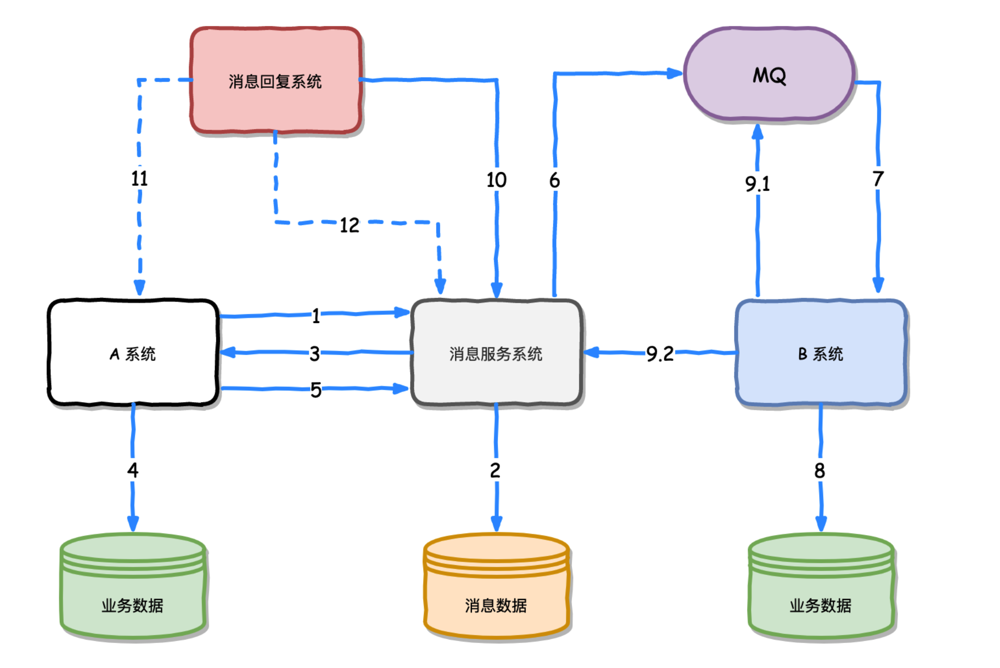

## mq 

### 正常流程：
- A 系统发送预发送消息给消息服务系统。
- 消息服务系统存储预发送的消息到消息数据库。
- 消息服务系统返回存储预发送消息的结果到 A 系统。
- 如果第 3 步返回的结果是成功的， A 系统则执行业务操作，否则不执行。
- A 系统业务操作成功后，通知消息服务系统 。
- 消息服务系统发送消息到 MQ ，并且更新预发送消息状态为已发送（但不是已消费）。
- MQ 发送消息到 B 系统。
- B 系统执行业务操作，保证幂等性，防止同一个消息重复执行。
- B 系统向 MQ ack 此条消息，并向消息服务系统进行确认成功消费消息，让消息服务系统将消息状态置为已消费。
- 消息恢复系统定时去消息服务系统查一下消息数据，查看有没有状态为非已消费（预发送和已发送）状态的超时（比如 2 分钟以上还未消费的）消息。
- 如果第 10 步发现有非已消费状态的超时消息，调用 A 系统提供的查询接口，查询次条消息对应的业务数据是否为处理成功。
- 如果业务数据是处理成功的状态，那么就再次调用确认并发送消息，即进入第 6 步。如果业务数据是处理失败的，那么就调用消息服务系统进行删除该条消息数据。

再来看看有错（比如说网络断了或者服务器挂了）的时候，这个系统是怎么保证一致性的：
- 第 1 步失败，相当于什么都没做。
- 第 2 步失败，第 3 步会返回失败结果，A 系统不执行业务操作。
- 第 3 步失败，A 系统不执行业务操作，消息恢复系统在第 12 步判断业务处理失败。
- 第 4 步失败，A 系统回滚业务，同样消息恢复系统在第 12 步判断业务处理失败。
- 第 5、6、7、8、9 步失败，消息恢复系统在第 12 步判断业务处理成功，重试第 6 步直到成功为止。如果在第 9 步失败了，B 系统会重复消费某条消息，所以 B 系统要设计成幂等操作，对于同一操作发起的一次请求或者多次请求的结果是一致的，不会因为多次调用而产生了副作用。

所以，只要消息数据持久化了，我就假设后面一定会被消费，就算后面挂了一堆东西，但是我们把挂掉的服务再全部启动，这条消息还是会被消费，不会丢失，可以保证最终一致性。
这种实现方案弱化了对消息中间件（MQ）的依赖，选用 RabbitMQ 或者 ActiveMQ 就可以实现。如果使用支持消息事物的 RocketMQ 也可以简化消息恢复系统和消息服务系统。