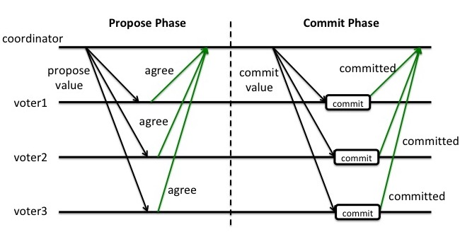

## 两阶段提交

Propose阶段:
- coordinator: "投票"
- voter1/voter2/voter3: "好的，收到!"

Commit阶段
- coordinator: "大家都投A"
- voter1/voter2/voter3: "投了" 


### 第一阶段(提交请求阶段)
- 协调者节点向所有参与者节点询问是否可以执行提交操作，并开始等待各参与者节点的响应。
- 参与者节点执行询问发起为止的所有事务操作，并将Undo信息和Redo信息写入日志。
- 各参与者节点响应协调者节点发起的询问。如果参与者节点的事务操作实际执行成功，则它返回一个"同意"消息；如果参与者节点的事务操作实际执行失败，则它返回一个"中止"消息。
有时候，第一阶段也被称作投票阶段，即各参与者投票是否要继续接下来的提交操作。

### 第二阶段(提交执行阶段)

####  成功
当协调者节点从所有参与者节点获得的响应消息都为"同意"时：

- 协调者节点向所有参与者节点发出"正式提交"的请求。
- 参与者节点正式完成操作，并释放在整个事务期间内占用的资源。
- 参与者节点向协调者节点发送"完成"消息。
- 协调者节点收到所有参与者节点反馈的"完成"消息后，完成事务。

#### 失败
如果任一参与者节点在第一阶段返回的响应消息为"终止"，或者协调者节点在第一阶段的询问超时之前无法获取所有参与者节点的响应消息时：

- 协调者节点向所有参与者节点发出"回滚操作"的请求。
- 参与者节点利用之前写入的Undo信息执行回滚，并释放在整个事务期间内占用的资源。
- 参与者节点向协调者节点发送"回滚完成"消息。
- 协调者节点收到所有参与者节点反馈的"回滚完成"消息后，取消事务。
有时候，第二阶段也被称作完成阶段，因为无论结果怎样，协调者都必须在此阶段结束当前事务。


### 基本过程
```go
//某个voter收到propose请求，开启事务
begin 开启事务
doBusiness 执行业务逻辑，更新数据库等
sendResultToCoordinator  发送agree给协调者
waitCommitOrAbort 等待协调者的commit或者abort结果，这个过程是漫长的，会阻塞，因为需要等到其他voter都向协调者确认后，才能收到commit或者abort

```


正常情况，事务通过



异常情况， 如果有至少一个voter (比如voter3)在Propose阶段投了反对票, 那么propose通过失败. coordinator就会在Commit(or abort)阶段跟所有voter说, 放弃这个propose


缺点

如果存在节点宕机的情况下，就不能解决一致性，coordinator发起提议后宕机，voter将会阻塞


